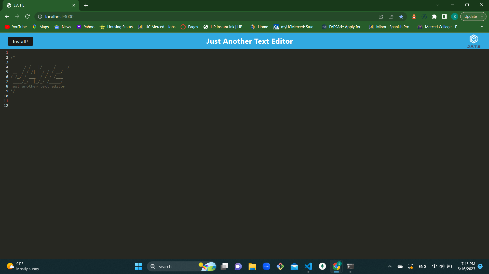

# PWA Text Editor

This is a progressive web application (PWA) text editor that allows you to create and store notes or code snippets, with or without an internet connection. The application utilizes data persistence techniques using IndexedDB, ensuring that your content is reliably saved and retrieved even in offline scenarios.

## Features

- Create and edit text content.
- Automatic data storage using IndexedDB.
- Offline functionality.
- Installable as a desktop application.
- Service worker for caching static assets.



## Getting Started

To run the text editor application locally, follow these steps:

1. Clone the repository:
   ```
   shell
   git clone <repository-url>
   ```
2. Install dependencies

   ```
   npm install

   ```

3. Start the backend server and serve the client:

   ```
   npm run start

   ```

4. Bundle JavaScript files using webpack:

   ```
   npm run build

   ```

5. Open your web browser and navigate to http://localhost:3000 to access the text editor application.

## Technologies Used

- Frontend:
  - HTML
  - CSS
  - JavaScript
  - Webpack
- Backend:
  - Node.js
  - Express.js
- Database
  - IndexedDB

## Folder Structure

The project follows a client-server folder structure:

- client/: Contains the frontend code.
- server/: Contains the backend code.

## Deployment

To deploy the application to Heroku, follow these steps:

1. Create a Heroku app.
2. Configure the necessary environment variables.
3. Set up the Heroku remote:

   ```
   heroku:git:remote -a <heroku-app-name>

   ```

4. Deploy the application:

   ```
   git push heroku main

   ```

For detailed instructions on deploying to Heroku, refer to the Heroku Deployment Guide(https://devcenter.heroku.com/articles/git).

## License

This project is licensed under the MIT License.

## Contact

For any inquiries or questions, you can reach me at saraysanchez01@yahoo.com.

## GitHub Repository

https://github.com/Ss0110/text-editor
